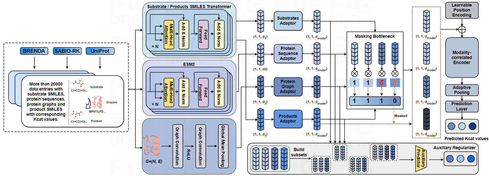

<h1 align="center">
  
  MMKcat
</h1>
<h2 align="center">A Multimodal Deep Learning Framework for Enzyme Turnover Prediction with Missing Modality</h2>

<p align="center"> 
  <a></a>
  <a></a>
  <a></a>
</p> 

🚩 **Update: 2025/05/29 Our paper has been accepted by Computers in Biology and Medicine, and can be obtained from this [link](https://www.sciencedirect.com/science/article/pii/S0010482525006997).**



Accurate prediction of the turnover number ($k_{\rm cat}$), which quantifies the maximum rate of substrate conversion at an enzyme's active site, is essential for assessing catalytic efficiency and understanding biochemical reaction mechanisms. Traditional wet-lab measurements of $k_{\rm cat}$ are time-consuming and resource-intensive, making deep learning (DL) methods an appealing alternative. However, existing DL models often overlook the impact of reaction products on $k_{\rm cat}$ due to feedback inhibition, resulting in suboptimal performance. The multimodal nature of this $k_{\rm cat}$ prediction task, involving enzymes, substrates, and products as inputs, presents additional challenges when certain modalities are unavailable during inference due to incomplete data or experimental constraints, leading to the inapplicability of existing DL models. To address these limitations, we introduce **MMKcat**, a novel framework employing a prior-knowledge-guided missing modality training mechanism, which treats substrates and enzyme sequences as essential inputs while considering other modalities as maskable terms. Moreover, an innovative auxiliary regularizer is incorporated to encourage the learning of informative features from various modal combinations, enabling robust predictions even with incomplete multimodal inputs. We demonstrate the superior performance of MMKcat compared to state-of-the-art methods, including DLKcat, TurNup, UniKP, EITLEM-Kinetic, DLTKcat and GELKcat, using BRENDA and SABIO-RK. Our results show significant improvements under both complete and missing modality scenarios in RMSE, $R^2$, and SRCC metrics, with average improvements of 6.41\%, 22.18\%, and 8.15\%, respectively.

<h2> ⚙️ Install Necessary Dependencies </h2>

- Firstly, please make sure that you have installed **ESM2** and **ESMFold** correctly with their corresponding pre-trained checkpoints. Concretely, you can follow the official instructions in this [repository](https://github.com/facebookresearch/esm) to prepare. Please note that we select **ESM2_t33_650M_UR50D** for **ESM2** in our experiments.
- After installing **EMS2** and **ESMFold** correctly, run the following command to complete this part:
```
pip install -r requirements.txt
```
- ⚠️ You may encounter the issue of the use of dssp for a error like *FileNotFoundError: \[Errno 2\] No such file or directory: 'mkdssp'*. If this doesn't happen, please ignore this. If so, to solve this problem, we use the following commands:
```
conda install -c ostrokach dssp
which mkdssp  # Here, we denote this path as 'dssp_path'
cd dssp_path
cp mkdssp dssp
```
Then we add this path to environmental variable **PATH** to make it work. It can also be added like the codes in model/test_example.py.

<h2> 🧰 Download Codes and Checkpoint Files for MMKcat </h2>

- Download this repository and put it under your root project folder like:
```
| MMKcat
|   | model
|   | ckpt
|   | data
|   | util
|   | ...
```
- We provide the link for downloading pre-trained checkpoint files of MMKcat, please get it from this [link](https://drive.google.com/drive/folders/1sVg9gfi_wQxZwbnylLrpmek15_aEbNs8?usp=drive_link) and put it in the folder **'ckpt'**.

<h2> 🧪 Perform $k_{\rm cat}$ Prediction for Chemical Reactions </h2>

Use the code in model/test_example.py for $k_{\rm cat}$ prediction.
```python
......
os.environ['TORCH_HOME'] = 'the_path_you_put_the_checkpoint_files_of_EMS2_and_ESMFold'
# Solve the issue of dssp
sys.path.append('../util')
current_path = os.environ.get('PATH', '')
new_path = 'the_path_of_installed_mkdssp (dssp_path mentioned above)'
os.environ['PATH'] = f"{new_path}:{current_path}"

......

if __name__ == '__main__':
    # Replace the values of these variables to your chemical reactions
    substrate_smiles = ["CSCC[C@H](N)C(O)=NCC(=O)O"]
    protein_sequence = "MFLLPLPAAARVAVRHLSVKRLWAPGPAAADMTKGLVLGIYSKEKEEDEPQFTSAGENFNKLVSGKLREILNISGPPLKAGKTRTFYGLHEDFPSVVVVGLGKKTAGIDEQENWHEGKENIRAAVAAGCRQIQDLEIPSVEVDPCGDAQAAAEGAVLGLYEYDDLKQKRKVVVSAKLHGSEDQEAWQRGVLFASGQNLARRLMETPANEMTPTKFAEIVEENLKSASIKTDVFIRPKSWIEEQEMGSFLSVAKGSEEPPVFLEIHYKGSPNASEPPLVFVGKGITFDSGGISIKAAANMDLMRADMGGAATICSAIVSAAKLDLPINIVGLAPLCENMPSGKANKPGDVVRARNGKTIQVDNTDAEGRLILADALCYAHTFNPKVIINAATLTGAMDIALGSGATGVFTNSSWLWNKLFEASIETGDRVWRMPLFEHYTRQVIDCQLADVNNIGKYRSAGACTAAAFLKEFVTHPKWAHLDIAGVMTNKDEVPYLRKGMAGRPTRTLIEFLFRFSQDSA"
    # If products are unknown, please set this variable as: product_smiles = [[None]]
    product_smiles = ["NCC(=O)O", "CSCC[C@H](N)C(=O)O"]

    kcat = predict_kcat(substrate_smiles=substrate_smiles, protein_sequence=protein_sequence,
                        product_smiles=product_smiles)

    # Report the results in both log10 and transformed
    print(kcat, math.pow(10, kcat))
```

<h2> 🏗️ Re-training and Testing (Optional) </h2>

If you would like to re-train MMKcat based on your own software and hardware environments, you can get the full traning data and testing data from this [link](https://drive.google.com/drive/folders/1ry4JpdD3jWTO-WsLOnobmr6AyhYz562j?usp=drive_link) and put them in the folder **'data'**. Then you can run model/train_model.py and model/test_model.py to finish this:
```python
cd model
python train_model.py  # OR
python test_model.py
```

<h2> 🔋 Citation </h2>
If you find this repository helpful, please cite our paper:
```
@article{sun2025multimodal,
  title={A multimodal deep learning framework for enzyme turnover prediction with missing modality},
  author={Sun, Xin and Wang, Yu Guang and Shen, Yiqing},
  journal={Computers in Biology and Medicine},
  volume={193},
  pages={110348},
  year={2025},
  publisher={Elsevier}
}
